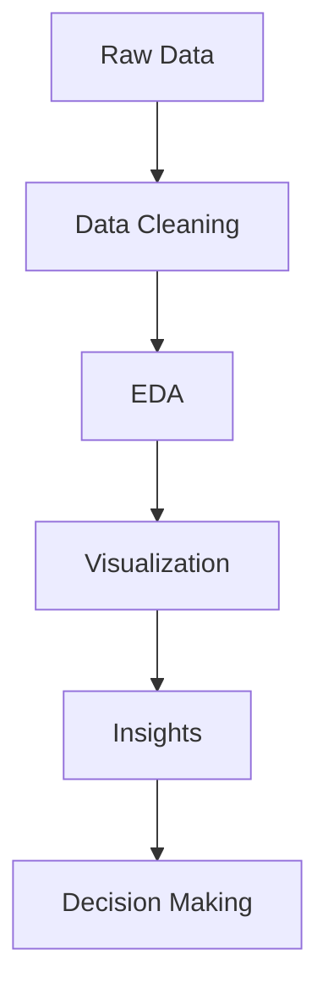

<h1 align="center">📊 Data Analyst Portfolio</h1>
<h3 align="center">Transforming Raw Data into Business Intelligence</h3>

  
  
  

  
  
  

---

## 🚀 About Me

Hi, I'm **Sarthak Raj**  
A passionate **Data Analyst** focused on turning raw data into meaningful business insights.

I specialize in:

✔ Data Cleaning  
✔ Exploratory Data Analysis  
✔ Dashboard Development  
✔ SQL Query Optimization  
✔ Business Intelligence    

---

## ⚡ Tech Stack

### Programming

---

### Data Analysis Libraries

---

### BI Tools

---

## 📂 Featured Projects

## 📈 Sales Analysis Dashboard

### Tools Used:
Python | Power BI | Excel | Pandas

### Highlights:
- Revenue trend analysis
- Profitability insights
- Product performance analysis

---

## 👥 Customer Segmentation

### Tools Used:
Python | Machine Learning | Tableau

### Highlights:
- Customer clustering
- Behavior analytics
- Retention strategy insights

---

## 🏢 HR Analytics Dashboard

### Tools Used:
Power BI | Excel

### Highlights:
- Employee attrition analysis
- Department insights
- Workforce optimization

---

## 📊 GitHub Analytics

---

## 📈 Data Analyst Workflow

---

## 🎯 Core Competencies

| Skill | Level |
|--|--|
| Python | Advanced |
| SQL | Advanced |
| Excel | Advanced |
| Power BI | Advanced |
| Tableau | Intermediate |
| Machine Learning | Intermediate |

---

## 📌 What This Portfolio Shows

✔ Real-world projects  
✔ Business problem-solving  
✔ Data storytelling  
✔ Dashboard building  
✔ SQL expertise  
✔ Machine learning applications  

---

## 🌐 Connect With Me

---

## ⭐ Support

If you found this repository useful, give it a star ⭐

---

## 📜 License

Licensed under MIT License
